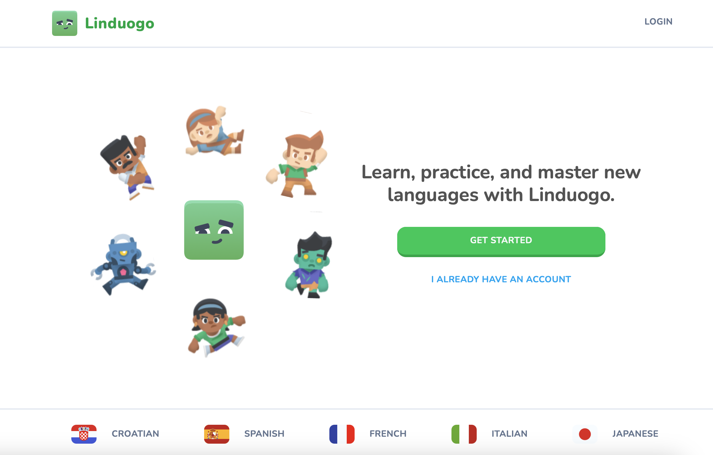
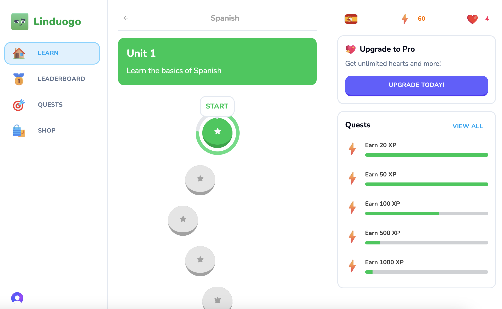
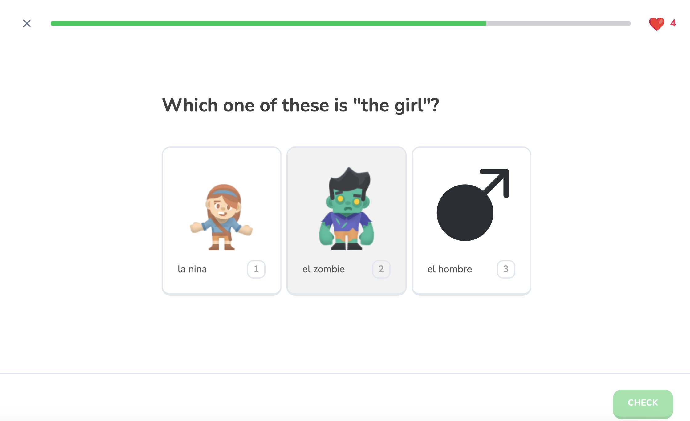
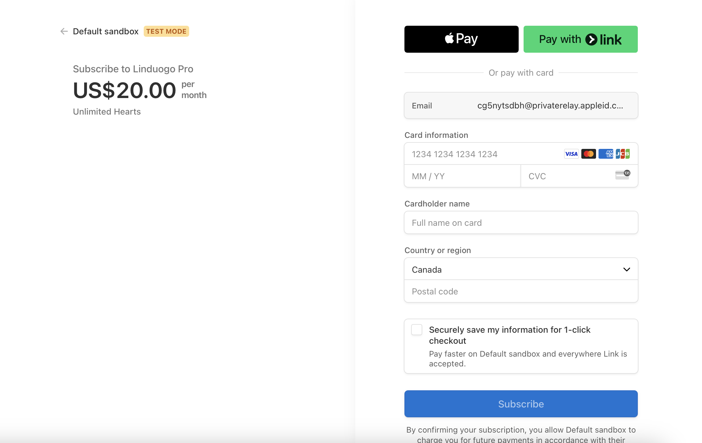

# 📚 Linduogo – Multilingual Language Learning Web App

**Linduogo** is a modern web application designed to facilitate language learning through interactive vocabulary exercises and reading modules. It supports multiple languages, including English, French, and Chinese, offering users a comprehensive platform to enhance their language skills.

> 🔗 **Live Demo**: [https://linduogo-jack-smiths-projects-f660ecbf.vercel.app](https://linduogo-jack-smiths-projects-f660ecbf.vercel.app)

---

## ✨ Key Features

- 🔤 **Vocabulary Practice**: Interactive exercises with translation hints to reinforce word retention.
- 📚 **Reading Modules**: Sentence-level translations to aid comprehension of multilingual texts.
- 📝 **User Accounts**: Personalized progress tracking to monitor learning milestones.
- 🌐 **Multilingual Interface**: Seamless switching between English, French, and Chinese.
- ⚡ **Responsive Design**: Optimized for various devices with fast load times and smooth navigation.

---

---

## 📸 Screenshots

### 🏠 Homepage

*Landing page with vocabulary and reading options.*

### 📚 Course Page

*Overview of available language courses.*

### 📝 Exercise Page

*Interactive vocabulary practice with real-time feedback.*

### 💳 Payment Page

*Secure payment interface for course subscriptions.*

---

## 🧠 Tech Stack

- **Frontend**: Next.js 14, React, Tailwind CSS
- **Backend**: Next.js API Routes, PostgreSQL
- **Authentication**: JSON Web Tokens (JWT) and session management
- **Deployment**: Vercel (leveraging both Server-Side Rendering and static generation)

---

